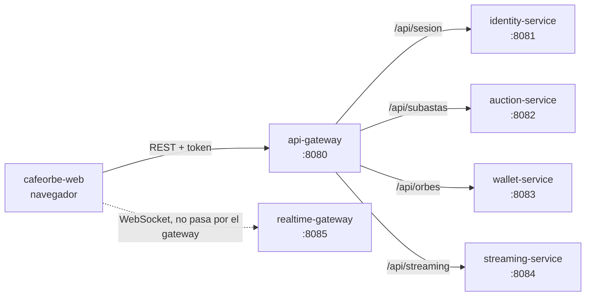
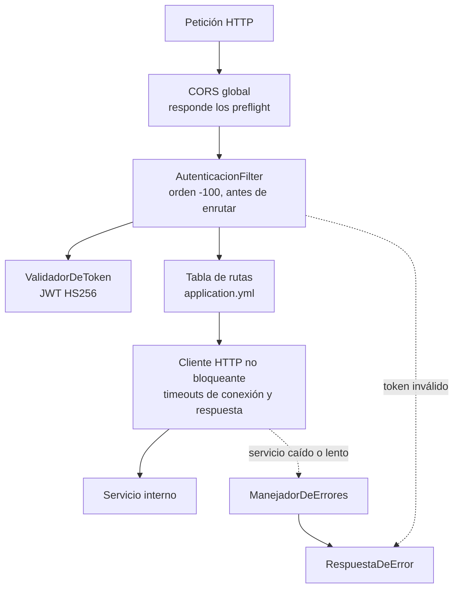
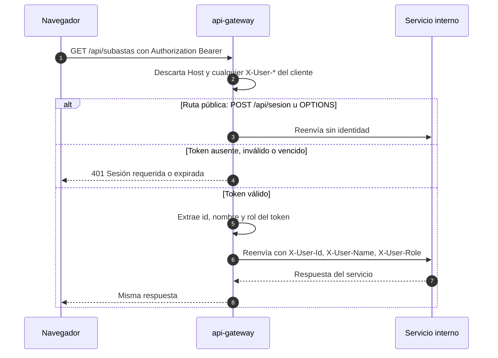
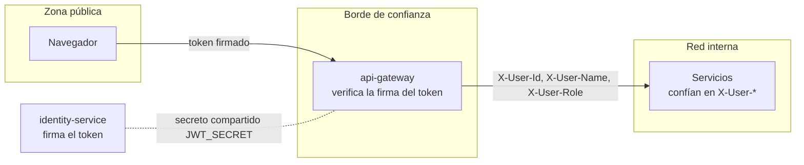
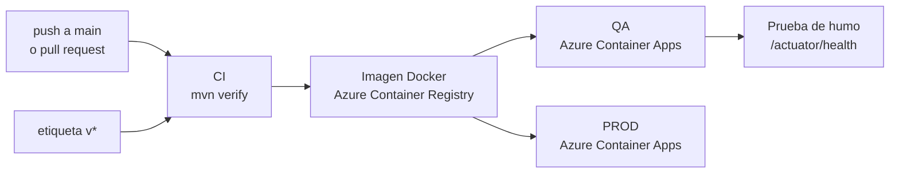

# cafeorbe-api-gateway

> Puerta de entrada HTTP de CaféOrbe: un solo punto donde se autentica cada petición, se decide a qué servicio va y se uniforman los errores. No contiene reglas de negocio.

| | |
|---|---|
| **Responsabilidad** | Enrutamiento, validación de la sesión, CORS y errores uniformes |
| **Estilo interno** | Patrón API Gateway, sin capas de dominio |
| **Stack** | Java 21 · Spring Boot 3.5 · Spring Cloud Gateway (WebFlux, no bloqueante) |
| **Persistencia** | Ninguna: no guarda estado |
| **Puerto** | `8080` |
| **Historias** | Transversal: todas las llamadas REST del navegador |
| **Depende de** | identity, auction, wallet y streaming |

## Contenido

1. [Contexto](#1-contexto)
2. [Arquitectura interna](#2-arquitectura-interna)
3. [Tabla de rutas](#3-tabla-de-rutas)
4. [Flujo de una petición](#4-flujo-de-una-petición)
5. [Modelo de confianza](#5-modelo-de-confianza)
6. [Errores uniformes](#6-errores-uniformes)
7. [Decisiones de arquitectura](#7-decisiones-de-arquitectura)
8. [Atributos de calidad](#8-atributos-de-calidad)
9. [Configuración](#9-configuración)
10. [Ejecución y pruebas](#10-ejecución-y-pruebas)
11. [Despliegue](#11-despliegue)
12. [Riesgos conocidos y evolución](#12-riesgos-conocidos-y-evolución)

---

## 1. Contexto



Todo el tráfico REST del navegador entra por aquí. El **WebSocket no**: el navegador se conecta directo al realtime-gateway, que valida el mismo token por su cuenta. La comunicación entre servicios internos tampoco pasa por el gateway.

## 2. Arquitectura interna

El servicio son dos filtros y una tabla de rutas. Agregarle capas o un modelo de dominio sería código muerto.



| Pieza | Ubicación | Función |
|---|---|---|
| Tabla de rutas | `application.yml` | Qué prefijo va a qué servicio |
| `AutenticacionFilter` | `filters/auth` | Valida el token y propaga la identidad |
| `ValidadorDeToken` | `filters/auth` | Verifica la firma y la vigencia del JWT |
| `ManejadorDeErrores` | `filters/errors` | Traduce fallos de los servicios a 503, 504 o 404 |
| `RespuestaDeError` | `filters/errors` | Escribe el formato único de error |

## 3. Tabla de rutas

| Prefijo | Servicio destino | Variable |
|---|---|---|
| `/api/sesion/**` | identity-service | `IDENTITY_URL` |
| `/api/subastas/**` | auction-service | `AUCTION_URL` |
| `/api/orbes/**` | wallet-service | `WALLET_URL` |
| `/api/streaming/**` | streaming-service | `STREAMING_URL` |

**Solo se expone lo que pertenece a una historia del MVP.** Cualquier otra ruta responde `404` con el formato uniforme. En particular, las rutas `/internal/**` de los servicios (consulta de saldo entre servicios, webhooks de LiveKit) no se enrutan.

## 4. Flujo de una petición



Solo dos casos no exigen token: `POST /api/sesion` (el ingreso) y los preflight `OPTIONS` de CORS.

## 5. Modelo de confianza

La seguridad del sistema descansa en una regla: **la identidad se verifica una sola vez, en el borde, y los servicios internos confían en lo que el gateway les dice.**



| Mecanismo | Detalle |
|---|---|
| Token | JWT firmado con HS256 por identity-service. Contiene id, nombre y rol; vence a las 8 horas |
| Verificación | El gateway comparte el secreto `JWT_SECRET` con identity y con realtime-gateway |
| Antisuplantación | Las cabeceras `X-User-*` que envíe el cliente **se descartan siempre** antes de enrutar |
| Nombres con tildes | `X-User-Name` viaja codificado como URL (UTF-8); el servicio receptor lo decodifica |
| Cabecera `Host` | Se descarta la del cliente para que el cliente HTTP ponga la del servicio destino, necesario cuando el ingreso enruta por nombre de host |

**Consecuencia directa:** los puertos de los servicios internos no deben ser accesibles desde fuera de la red interna. Un atacante que llegue directo a un servicio puede fabricar las cabeceras `X-User-*`.

## 6. Errores uniformes

Todas las respuestas de error, las propias y las de los servicios, tienen la misma forma:

```json
{ "status": 503, "mensaje": "El servicio no está disponible, intenta de nuevo en unos segundos", "campos": {} }
```

| HTTP | Origen | Cuándo |
|:-:|---|---|
| `401` | Gateway | Token ausente, inválido o vencido |
| `404` | Gateway | La ruta no pertenece al MVP |
| `503` | Gateway | El servicio destino rechaza la conexión o la cierra antes de responder |
| `504` | Gateway | El servicio tarda más de 10 s en responder |
| Otros | Servicio | Se devuelven tal cual (400, 403, 409, 422) |

## 7. Decisiones de arquitectura

| Decisión | Motivo | Costo aceptado |
|---|---|---|
| Sin lógica de negocio ni base de datos | Un gateway con reglas se vuelve un monolito disfrazado y un cuello de botella para todos los equipos | Cada servicio valida sus propios permisos |
| Validación local del token (sin llamar a identity) | No agrega un salto de red por petición y el gateway sigue funcionando si identity cae | El token no se puede revocar antes de que venza |
| Identidad propagada por cabeceras | Los servicios no necesitan conocer JWT ni compartir el secreto | Exige una red interna cerrada |
| Pila no bloqueante (WebFlux) | Un gateway es puro tráfico de entrada y salida: pocos hilos atienden muchas conexiones | Modelo de programación reactivo |
| WebSocket fuera del gateway | Las conexiones largas tienen otro patrón de escalado y otro servicio especializado | El realtime-gateway repite la validación del token |
| Lista cerrada de rutas | Superficie de ataque mínima; lo que no está en la tabla no existe | Cada endpoint nuevo exige tocar la configuración |

## 8. Atributos de calidad

| Atributo | Cómo se logra |
|---|---|
| **Seguridad** | Autenticación en el borde, cabeceras de identidad saneadas, CORS restringido a los orígenes configurados, rutas internas ocultas |
| **Resiliencia** | Timeout de conexión de 2 s y de respuesta de 10 s: un servicio lento no agota al gateway |
| **Escalabilidad** | Sin estado: se pueden agregar instancias detrás de un balanceador sin coordinación |
| **Operabilidad** | `GET /actuator/health`. Las respuestas 5xx se registran con método, ruta y causa |
| **Experiencia de uso** | El frontend maneja un solo formato de error, venga de donde venga |

## 9. Configuración

| Variable | Por defecto | Uso |
|---|---|---|
| `IDENTITY_URL` | `http://localhost:8081` | Destino de `/api/sesion` |
| `AUCTION_URL` | `http://localhost:8082` | Destino de `/api/subastas` |
| `WALLET_URL` | `http://localhost:8083` | Destino de `/api/orbes` |
| `STREAMING_URL` | `http://localhost:8084` | Destino de `/api/streaming` |
| `JWT_SECRET` | valor de desarrollo | Secreto compartido con identity y realtime (mínimo 32 caracteres) |
| `CORS_ORIGINS` | `http://localhost:5173` | Orígenes permitidos del frontend |

## 10. Ejecución y pruebas

Requiere **Java 21** y el módulo `cafeorbe-contracts` instalado (`mvn install` en ese repositorio).

```bash
mvn spring-boot:run      # los servicios destino deben estar arriba: ver cafeorbe-infra
mvn test                 # 7 pruebas contra un servicio interno simulado, sin infraestructura
```

Las pruebas (`GatewayTest`) cubren: ingreso público, rechazo sin token, inyección de las cabeceras de identidad, descarte de cabeceras suplantadas, rutas fuera del MVP, servicio caído y CORS.

## 11. Despliegue



El pipeline (`.github/workflows/ci.yml`) despliega en QA con cada cambio en `main` y en PROD con una etiqueta `v*`. En Azure, el gateway alcanza a los servicios por sus nombres internos y permite como origen el frontend desplegado.

## 12. Riesgos conocidos y evolución

| Riesgo o deuda | Impacto | Acción propuesta |
|---|---|---|
| `use-insecure-trust-manager: true` | El gateway no valida el certificado de los servicios internos. Se activó porque el certificado del entorno no cubre los nombres internos | Certificado válido para los nombres internos, o tráfico interno por HTTP dentro de la red privada |
| Sin límite de peticiones | Un cliente puede saturar un servicio | Rate limiting por usuario en el gateway |
| Token sin revocación | Cerrar sesión solo borra el token en el navegador; sigue siendo válido hasta 8 horas | Lista de revocación o tokens de vida corta con renovación |
| Sin reintentos ni cortacircuitos | Un servicio intermitente devuelve errores directos al usuario | Circuit breaker para lecturas idempotentes |
| Secreto simétrico compartido | Los tres servicios que validan el token también podrían firmarlo | Firma asimétrica: identity firma, los demás solo verifican |
